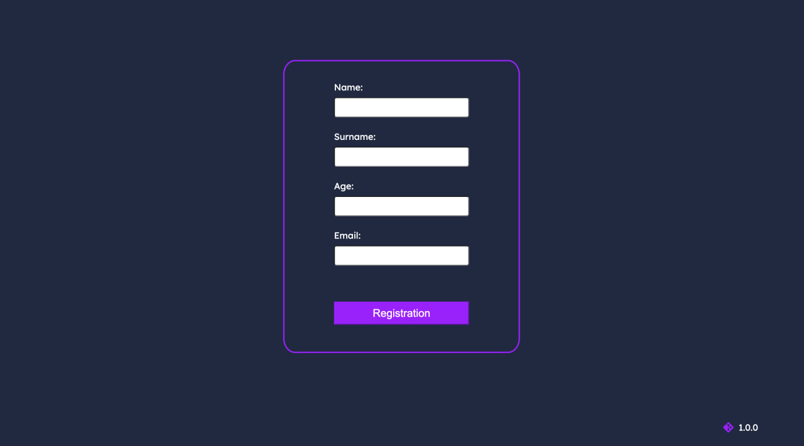
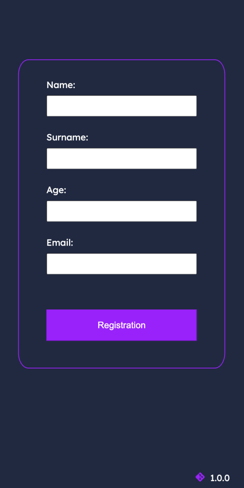

 

# About

[RegForm]( https://nikita-1vanov.github.io/RegForm/) - a simplified registration form. The fields have validation for the input characters and their quantity. There are two statuses for adding a user: "Success" and "Error." The list of available users can be accessed on the user [list page]( https://nikita-1vanov.github.io/RegForm/list).

### Example of the desktop version
 

 

 

### Example of the mobile version

 